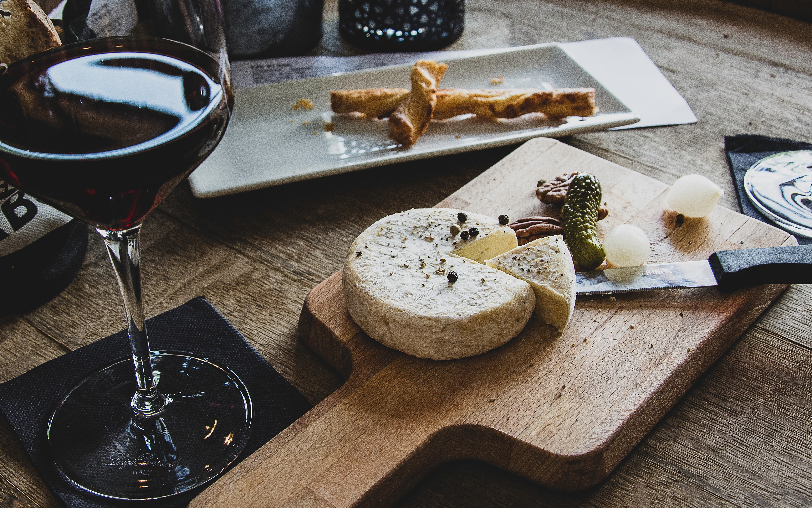

<h1 align="center">
    Gourmet Shop
</h1>

### Link

https://gourmet-shop.vercel.app/

## About



I developed an online gourmet product store using Next.js and Typescript. I used Node.js for the server-side and got inspiration from a commercial website for healthy supplements for the project's design.


## Tools

- TypeScript
- React.js
- Tailwind
- Next.js
- MongoDB

## Goals

To develop using a more typed language, become familiar with Next.js using its main tools, and practice Tailwind. I also plan to implement authentication, checkout, shopping cart, and a blog in the project. The challenge included dealing with different layouts for desktop and mobile and using Typescript, which, while helpful in error prevention, also brought typing challenges.

## Instalação

```bash
    $git clone https://github.com/vitorMoraes03/gourmet-shop.git
    $cd gourmet-shop
    $npm install
```
